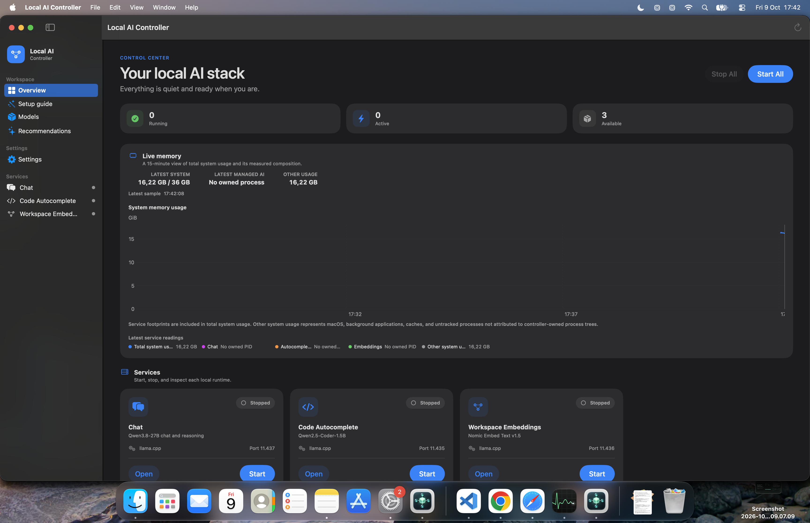

# Mochi

<p align="center">
  
</p>


Mochi is a native macOS menu-bar and desktop application for
starting, stopping, configuring, and monitoring three local `llama.cpp` model
services.

The app manages:

- Qwen chat through `llama.cpp`
- Qwen code autocomplete through `llama.cpp`
- Nomic workspace embeddings through `llama.cpp`


## Table of contents

- [Screenshots](#screenshots)
- [Requirements](#requirements)
- [Build the app](#build-the-app)
- [Open the app](#open-the-app)
- [Use the controller](#use-the-controller)
- [Launch configuration](#launch-configuration)
- [Model recommendations](#model-recommendations)
- [Data locations](#data-locations)
- [Repository structure](#repository-structure)
- [Development](#development)
- [Documentation](#documentation)
- [Troubleshooting](#troubleshooting)
- [License](#license)

## Screenshots

The controller exposes llama.cpp endpoints over your chosen network binding.
This overview is a real capture of the app with all three services stopped;
it shows the control center, memory dashboard, service cards, and navigation.



## Requirements

- Apple Silicon Mac running macOS 14 or later
- Xcode command-line tools or Xcode with Swift 6
- Tailscale installed and connected when using the default Tailscale bind mode
- `llama.cpp` for the three llama.cpp services

Install runtime dependencies separately with Homebrew if needed:

```bash
brew install llama.cpp tailscale
```

Port checks use the `lsof` utility included with macOS at `/usr/sbin/lsof`;
installing a separate Homebrew copy is not required.

Connect Tailscale before starting services:

```bash
tailscale up
```

The controller never installs dependencies or runs privileged commands. Each
service screen controls whether startup uses cached models only or explicitly
allows downloads for missing configured models.

## Build the app

From this repository, run:

```bash
./build_app.sh
```

The locally signed application will be created at:

```text
dist/Mochi.app
```

## Open the app

Open it from Finder by double-clicking `dist/Mochi.app`, or run:

```bash
open "dist/Mochi.app"
```

If macOS blocks the first launch, Control-click the app in Finder, choose
**Open**, and confirm **Open**. The app is locally signed and is not notarized
for public distribution.

The app opens a management window and adds a CPU icon to the macOS menu bar.
If the main window is closed, use that menu-bar icon and select **Open
Controller**.

## Use the controller

The Services sidebar shows each runtime and its current state:

- **Start** launches one service with the configuration shown on its screen.
- **Stop** gracefully stops a service launched by the controller.
- **Start All** validates and uses the saved configuration for the three llama.cpp services.
- **Stop All** stops all verified controller-managed services.
- **Copy Logs**, **Clear**, and **Reveal** manage each service's local log.

If a process is already using a configured port but was not launched by the
controller, it is marked **External** and will not be terminated.

When quitting with managed services active, choose whether to keep them
running, stop them, or cancel quitting.

## Launch configuration

The default ports are:

| Service | Port |
| --- | ---: |
| Code autocomplete | `11435` |
| Workspace embeddings | `11436` |
| llama.cpp chat | `11437` |

Select a service to configure its port, network binding, download policy, and
model selection directly above the Start button. Model menus combine cached
Hugging Face GGUF files with launchable
catalog recommendations; local, role-matched choices appear first. Use
**Rescan** after installing a model outside the app. Expand **Advanced** to tune
context size, GPU layers, or enter a custom model.
Configurations are saved
per service between launches, and **Reset to Defaults** restores the values
listed by the bundled launcher scripts.

Selecting a catalog model marks it as requiring a download. If the service is
set to **Cached only**, Start asks before switching that service to **Allow
downloads**; canceling leaves the configuration unchanged.

The available bind modes are **Tailscale**, **Localhost**, and **Local network**.
Local-network mode exposes an unauthenticated API and therefore requires an
explicit confirmation on every launch. Custom model identifiers also require
confirmation because their memory requirements have not been verified. Fields
are locked while their service is active; stop the service before editing its
next-launch configuration.

The Overview's **Test Tailscale** action selects an online peer and reports
whether connectivity is direct, relayed, or unreachable. Tailscale-bound
service launches run the same test first. Relayed or failed tests produce a
warning but do not prevent an acknowledged launch; a failed ping can indicate
a firewall, tailnet policy, or peer availability problem rather than proving a
specific cause.

When that warning appears, **Start Locally** launches Tailscale-configured
services on `127.0.0.1` for that run without changing their saved configuration.
A **Start on Wi-Fi** option is also shown when Wi-Fi has an active IPv4 address;
it listens on all local interfaces and displays the Wi-Fi address, so other
devices on that network can connect. This mode exposes the unauthenticated APIs
to the local network.
A Tailscale-bound service listens only on its `100.x.x.x` address and is not
also available through localhost. Running service cards, service details, and
logs show the complete endpoint where each model is available.

The separate Settings window provides the optional **Launch at Login** setting,
disabled by default.

## Model recommendations

Select **Recommendations** in the sidebar to view read-only suggestions from
Hugging Face GGUF listings. The controller checks at
most once per day and also provides a manual **Check Now** button.

Only models with complete metadata, a known llama.cpp-compatible architecture,
and a conservative fit for this Mac can be labeled **Compatible**. Unknown,
oversized, and gated models are shown as **Unverified**. Cloud-only and
multimodal models are rejected and stay visible in the list with the reason.

Capability comes from signals that are actually read:

- **Hugging Face** — the model's `pipeline_tag` and tags, plus any `mmproj`
  projector file in a downloaded snapshot.

Models this controller manages are text-only, so an installed multimodal model
is reported as **Multimodal (not supported)** and is not offered in a launch
picker. A model already saved in a configuration is still listed, so switching
to a supported model is always possible.

Recommendations are informational only. They do not include download, install,
or launch actions.

## Data locations

Service logs, process records, and the recommendation cache are stored under:

```text
~/Library/Application Support/Mochi/
```

Per-service launch profiles and app preferences are stored through macOS user
defaults.

## Repository structure

```text
Sources/Mochi/     SwiftUI + AppKit application code
Tests/MochiTests/  Unit and integration-style tests with fakes
AppResources/                  Info.plist and application icon
docs/                          Architecture, style, and workflow guides
start_llama_network.sh         llama.cpp launcher
build_app.sh                   Release build and app-bundle packaging
check_code_line_lengths.sh     250-line authored-file quality gate
```

## Development

The package is built and tested with Swift Package Manager:

```bash
swift build                    # build the app
swift test                     # run the test suite
./check_code_line_lengths.sh   # 250-line authored-file quality gate
./scripts/validate_repository.sh # full local validation and contract checks
```

Run `swift test --filter <TestClassName>` to iterate on a focused test. `./build_app.sh` (see [Build the app](#build-the-app)) produces the signed `dist/Mochi.app` bundle.

## Documentation

Detailed guidance lives in [`docs/`](docs/):

- [`architecture.md`](docs/architecture.md) — MVVM + Clean Architecture layout and dependency boundaries.
- [`swift-style.md`](docs/swift-style.md) — Swift and file-size conventions.
- [`swiftui.md`](docs/swiftui.md) — SwiftUI/AppKit and theming rules.
- [`service-lifecycle.md`](docs/service-lifecycle.md) — service state machine and process-ownership safety.
- [`security-and-networking.md`](docs/security-and-networking.md) — bind modes and exposure controls.
- [`testing.md`](docs/testing.md) — test conventions and pre-handoff gates.
- [`agentic-workflows.md`](docs/agentic-workflows.md) — how agents should work in this repository.
- [`engineering-practices-audit.md`](docs/engineering-practices-audit.md) — applicability and status of the 50 engineering practices.

`how_to.md` covers network and editor client setup in more depth.

## Troubleshooting

- **Runtime not installed:** Install the named dependency outside the app and
  refresh the service status.
- **Tailscale not connected:** Run `tailscale up`, confirm it has an IPv4
  address, and retry, or select Localhost on the service screen.
- **Model missing:** Select **Allow downloads** on the service screen, or install
  the model outside the controller. **Cached only** uses llama.cpp offline mode.
- **Port occupied:** Stop the external process or choose another port on the
  service screen.
- **Service fails during startup:** Open that service and inspect its log for
  the exact runtime error. Preflight and launcher failures also display an
  immediate alert with corrective guidance and a **Reveal Log** button.
- **Recommendations unavailable:** Registry or network failures do not affect
  model controls. Use **Check Now** after connectivity returns.

Every start attempt appends timestamped diagnostics to the service log before
checking dependencies, ports, memory, disk space, or Tailscale. Earlier attempts
remain available after a retry or app relaunch.

For the detailed network and editor configuration, see [how_to.md](how_to.md).

## Build status

Verification run on 2026-10-09:

| Check | Status | Notes |
| --- | --- | --- |
| Authored-file line-length gate | Passing | `./check_code_line_lengths.sh` |
| Repository validation | Needs attention | Existing trailing whitespace in `ServiceManagerPolicy.swift:27` |
| Release app packaging | Passing | `./build_app.sh` produced and signed `dist/Mochi.app` |
| Swift build and tests | 2 failures | 154 tests executed; failures are in `MemoryMonitoringTests` and `StartupValidationTests` due to expectations that no longer match the current code. |

Run the full local checks with:

```bash
./check_code_line_lengths.sh
swift test
./scripts/validate_repository.sh
./build_app.sh
```

## License

This repository is not currently under an explicit license. Copyright remains
with its author, and no rights beyond local, personal use are granted. If you
want to publish or share it, add a `LICENSE` file and update this section to
name the chosen license.
