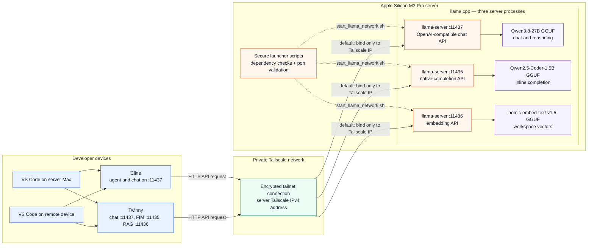

Here is the updated **Complete Setup Guide**, fully integrated with our tool capability analysis, network orchestration, and configuration matrix.

---

# Complete Setup Guide: Multi-Port Local LLM Infrastructure

**Target Environment:** macOS (Apple Silicon M3 Pro, 36GB Unified Memory)

**Core Components:** `llama-server` (`llama.cpp`), Homebrew, Tailscale, VS Code, **Cline**, and **Twinny**.

## Local AI Controller desktop app

The native macOS controller provides both a menu-bar status item and a full
window for starting and stopping the configured services, inspecting logs, and
viewing read-only model recommendations. It never installs dependencies.
Downloads occur only after choosing **Allow Downloads** in the start prompt;
**Cached Only** enforces offline/no-pull mode. Unsupported and unverified models
cannot be started.

Build the locally signed application:

```bash
./build_app.sh
```

The result is `dist/Local AI Controller.app`. The application uses the bundled
launcher scripts in offline/no-pull mode, stores logs and process records under
`~/Library/Application Support/Local AI Controller/`, and preserves services
when requested at quit. The llama.cpp chat port defaults to `11437` and can be
changed in the app's Settings window.

The Recommendations screen checks the official Ollama library and recent
Hugging Face GGUF listings at most once per day. Only entries with complete,
conservatively compatible metadata can produce a notification. Recommendations
are informational: the app provides no install, download, or launch action.

---

## Architectural Division of Labor

Before configuring the tools, it is vital to understand the separation of responsibilities between your models and VS Code extensions:

The following Mermaid diagram shows the complete request path for the
three-process `llama.cpp` setup.



### Simple two-computer connection

This simplified view shows how a second computer reaches the model server. Both
computers must be signed in to the same Tailscale network. Use the server Mac's
Tailscale IP address in the client applications; do not use its Wi-Fi address.

```mermaid
flowchart LR
    Client["Computer 1 — Client<br/>VS Code + Cline/Twinny"]
    Tailnet["Tailscale<br/>encrypted private network"]
    Server["Computer 2 — Server Mac<br/>three llama-server processes"]
    Models["Local GGUF models<br/>chat :11437 · FIM :11435 · embeddings :11436"]

    Client -->|"Request to http://TAILSCALE-IP:PORT"| Tailnet
    Tailnet -->|"Encrypted connection"| Server
    Server -->|"Runs inference"| Models
    Models -->|"Response"| Server
    Server -->|"Encrypted response"| Tailnet
    Tailnet -->|"Result"| Client

    classDef computer fill:#e8f1ff,stroke:#2563eb,color:#111827
    classDef network fill:#ecfdf5,stroke:#059669,color:#111827
    classDef model fill:#f5f3ff,stroke:#7c3aed,color:#111827
    class Client,Server computer
    class Tailnet network
    class Models model
```



For example, if Computer 2 has Tailscale address `TAILSCALE_IP`, Computer 1
connects to `http://TAILSCALE_IP:11437`. With the llama.cpp setup, ports
`11435` and `11436` provide autocomplete and embeddings respectively.

### Connection and security rules

- The default `--bind tailscale` mode listens only on the server's Tailscale
  IPv4 address. Both local and remote clients should use that address.
- `--bind localhost` is for clients running exclusively on the server Mac.
- `--bind lan` listens on every interface and exposes an unauthenticated API.
  Use it only on a trusted network and never expose these ports to the public
  internet.
- In this llama.cpp layout, port `11437` handles chat, `11435` handles FIM
  autocomplete, and `11436` handles embeddings.

* **Cline (Port 11437):** Your **Agentic Task Engine**. Handles file creation, multi-file refactoring, terminal execution, and tool calls using the 27B model.
* **Twinny (Ports 11435 & 11436):** Your **Silent Editor Helper**. Twinny **does not support autonomous tool execution** (it cannot run terminal commands or auto-edit files on disk). Instead, it provides ultra-fast inline ghost-text code completion (FIM) and vectorizes your workspace into RAG embeddings.

---

## Step-by-Step Installation & Setup

1. **1. Install System Dependencies:** Homebrew, llama.cpp, and Tailscale.
Open your macOS Terminal and run:

```bash
# Update Homebrew and install core tools
brew update
brew install llama.cpp tailscale lsof

```

Authenticate Tailscale to ensure your services are accessible securely across your mesh network:

```bash
sudo tailscale up

```


2. **2. Create start_llama_network.sh:** Production Orchestrator Script.
Create the bash manager in your project directory:

```bash
cat << 'EOF' > start_llama_network.sh
#!/usr/bin/env bash

# Strict execution modes for error catching
set -euo pipefail

export PATH="/opt/homebrew/bin:/usr/local/bin:$PATH"

echo "=== Llama-Server Multi-Model Infrastructure Manager ==="

# 1. Check Tailscale installation
if ! command -v tailscale &> /dev/null; then
  echo "❌ Error: Tailscale binary not found. Run 'brew install tailscale' first."
  exit 1
fi

# 2. Check llama-server installation
if ! command -v llama-server &> /dev/null; then
  echo "⚙️ llama-server not found. Installing llama.cpp via Homebrew..."
  brew install llama.cpp
  if ! command -v llama-server &> /dev/null; then
     echo "❌ Error: Failed to install llama.cpp."
     exit 1
  fi
fi

# 3. Network IP checks
TAILSCALE_IP=$(tailscale ip -4 2>/dev/null | tr -d '[:space:]' || true)
if [ -z "$TAILSCALE_IP" ] || [[ "$TAILSCALE_IP" == *"Error"* ]] || [[ "$TAILSCALE_IP" == *"no current"* ]]; then
  echo "🔑 Tailscale inactive. Prompting login..."
  sudo tailscale up
  sleep 2
  TAILSCALE_IP=$(tailscale ip -4 | tr -d '[:space:]')
fi

# Get Wi-Fi interface IP (defaults to en0, falls back to en1)
LOCAL_IP=$(ipconfig getifaddr en0 2>/dev/null || ipconfig getifaddr en1 2>/dev/null || echo "")

# 4. Model choice selection
echo ""
echo "Select model service to run:"
echo "1) Qwen3.8-27B (Chat / Reasoning - Port 11437)"
echo "2) Qwen2.5-Coder-1.5B (Autocomplete - Port 11435)"
echo "3) Nomic Embed Text v1.5 (Workspace Embeddings - Port 11436)"
echo -n "Choice [1, 2 or 3, default 1]: "
read -r MODEL_CHOICE
MODEL_CHOICE=${MODEL_CHOICE:-1}

if [ "$MODEL_CHOICE" = "3" ]; then
   HF_REPO="nomic-ai/nomic-embed-text-v1.5-GGUF"
   HF_FILE="nomic-embed-text-v1.5.Q8_0.gguf"
   MODEL_ALIAS="nomic-embed-text"
   PORT=11436
   CTX_SIZE=8192
   EXTRA_FLAGS="--embedding --pooling mean"
elif [ "$MODEL_CHOICE" = "2" ]; then
   HF_REPO="Qwen/Qwen2.5-Coder-1.5B-Instruct-GGUF"
   HF_FILE="qwen2.5-coder-1.5b-instruct-q4_k_m.gguf"
   MODEL_ALIAS="Qwen2.5-Coder-1.5B"
   PORT=11435
   CTX_SIZE=8192
   EXTRA_FLAGS="-fa on --cache-reuse 256"
else
   HF_REPO="unsloth/Qwen3.8-27B-GGUF"
   HF_FILE="Qwen3.8-27B-UD-Q4_K_M.gguf"
   MODEL_ALIAS="Qwen3.8-27B"
   PORT=11437
   CTX_SIZE=16384
   EXTRA_FLAGS="-fa on --jinja -ctk q8_0 -ctv q8_0 --cache-reuse 256"
fi

# 5. Clear targeted port safely
if lsof -Pi :${PORT} -sTCP:LISTEN -t >/dev/null ; then
  echo "⚠️ Port ${PORT} busy. Freeing port ${PORT}..."
  PID=$(lsof -ti :${PORT})
  kill -9 $PID 2>/dev/null || true
  sleep 1
fi

# 6. Status Output
echo ""
echo "🌐 LLAMA-SERVER ACTIVE ($MODEL_ALIAS on Port $PORT)"
echo "--------------------------------------------------------"
echo "🔒 Remote Base URL: http://${TAILSCALE_IP}:${PORT}/v1"
if [ -n "$LOCAL_IP" ]; then
  echo "🏠 Local Wi-Fi Base URL: http://${LOCAL_IP}:${PORT}/v1"
fi
echo "💻 Localhost Base URL: http://localhost:${PORT}/v1"
echo "--------------------------------------------------------"

# 7. Execute server tuned for Apple Silicon Metal & M3 Pro
exec llama-server \
  -hf "$HF_REPO" \
  -hff "$HF_FILE" \
  --alias "$MODEL_ALIAS" \
  --host 0.0.0.0 \
  --port "$PORT" \
  -c "$CTX_SIZE" \
  -ngl 99 \
  $EXTRA_FLAGS
EOF

chmod +x start_llama_network.sh

```


3. **3. Launch Network Servers:** Persistent Terminals.
Open three terminal tabs to keep all services running simultaneously:

* **Tab 1:** Run `./start_llama_network.sh`, choose `1` $\rightarrow$ **Chat Server** (`11437`)
* **Tab 2:** Run `./start_llama_network.sh`, choose `2` $\rightarrow$ **FIM Autocomplete** (`11435`)
* **Tab 3:** Run `./start_llama_network.sh`, choose `3` $\rightarrow$ **Workspace Embeddings** (`11436`)

4. **Setup Cline (VS Code): Agent Execution & Tools.**

Install **Cline** from VS Code Extensions, open **Settings → API Configuration**, and use the following values:

| Setting | Local Mac | Remote device over Tailscale |
| --- | --- | --- |
| API Provider | `Llama` | `Llama` |
| Base URL | `http://localhost:11437` | `http://TAILSCALE_IP:11437` |
| OpenAI Compatible API Key | Leave empty | Leave empty |
| Model ID | `Qwen3.8-27B` | `Qwen3.8-27B` |
| Reasoning Effort | `None` | `None` |

The screenshot shows the remote Tailscale configuration. When the **Llama** provider is selected, enter the server origin only; do not append `/v1`. Cline adds the required API route.

5. **Setup Twinny (VS Code): Chat, Ghost Text & Codebase RAG.**

Install **Twinny** (`ext install rjmacarthy.twinny`). Open the Twinny provider settings and create the following three providers. Use `localhost` when VS Code runs on the server Mac, or `TAILSCALE_IP` when connecting from another device on the same Tailscale network. Enter only the hostname in the **Hostname** field—do not include `http://`.

### Twinny chat provider

| Setting | Value |
| --- | --- |
| Label | `llama.cpp` |
| Type | `Chat` |
| Provider | `llama.cpp` |
| Protocol | `http` |
| Hostname | `localhost` or `TAILSCALE_IP` |
| Port | `11437` |
| API Path | `/v1` |
| API Key | Leave empty |
| Model Name | `Qwen3.8-27B` |

Twinny appends `/chat/completions` to the base API path. The resulting remote endpoint is `http://TAILSCALE_IP:11437/v1/chat/completions`.

### Twinny autocomplete provider

| Setting | Value |
| --- | --- |
| Label | `llama.cpp FIM` |
| Type | `Autocomplete` |
| Provider | `llama.cpp` |
| Protocol | `http` |
| Hostname | `localhost` or `TAILSCALE_IP` |
| Port | `11435` |
| API Path | `/completion` |
| API Key | Leave empty |
| Model Name | `Qwen2.5-Coder-1.5B` |
| FIM Template | `automatic` |
| Repository level | Off |

The tested remote endpoint is `http://TAILSCALE_IP:11435/completion`. This is the native llama.cpp completion route, not `/v1/completions`.

### Twinny embeddings provider

| Setting | Value |
| --- | --- |
| Label | `llama.cpp EMBEDDING` |
| Type | `Embeddings` |
| Provider | `llama.cpp` |
| Protocol | `http` |
| Hostname | `localhost` or `TAILSCALE_IP` |
| Port | `11436` |
| API Path | `/v1/embeddings` |
| API Key | Leave empty |
| Model Name | `nomic-embed-text` |

The provider test shown in the screenshot returned a 768-dimensional embedding. After the provider test succeeds, click **Embed Workspace** in Twinny to build the project index.

For every provider, click **Test Provider** before saving. The captured remote tests succeeded for chat, autocomplete, and embeddings.

## Alternative: Ollama on One Shared Port

Ollama can provide the same three workloads through one daemon on port `11434`. Unlike the llama.cpp layout above, the client selects a model with each request, so separate ports and terminal tabs are not required.

The launcher uses these defaults:

| Workload | Ollama model | Native endpoint |
| --- | --- | --- |
| Chat and agentic tasks | `qwen3.8:27b` | `/api/chat` |
| FIM autocomplete | `qwen2.5-coder:1.5b` | `/api/generate` |
| Workspace embeddings | `nomic-embed-text:v1.5` | `/api/embeddings` |

Install the dependencies and start the server:

```bash
brew install ollama tailscale lsof
sudo tailscale up
./start_ollama_network.sh
```

The script starts Ollama with flash attention, a Q8 KV cache, a 16K default context, and two parallel request slots. It checks the local model inventory and automatically pulls only missing models. The initial download requires roughly 20 GB plus temporary transfer space. Ollama loads and evicts models as requests arrive instead of keeping all three resident in memory.

To substitute a model without editing the script, set one or more overrides before launching:

```bash
OLLAMA_CHAT_MODEL="qwen3.8:27b" \
OLLAMA_AUTOCOMPLETE_MODEL="qwen2.5-coder:1.5b" \
OLLAMA_EMBEDDING_MODEL="nomic-embed-text:v1.5" \
./start_ollama_network.sh
```

### Cline with Ollama

In **Cline → Settings → API Configuration**, configure:

| Setting | Local Mac | Remote device over Tailscale |
| --- | --- | --- |
| API Provider | `Ollama` | `Ollama` |
| Base URL | `http://localhost:11434` | `http://TAILSCALE_IP:11434` |
| API Key | Leave empty | Leave empty |
| Model ID | `qwen3.8:27b` | `qwen3.8:27b` |

If a client does not offer a native Ollama provider, select its OpenAI-compatible provider and use `http://localhost:11434/v1` or `http://TAILSCALE_IP:11434/v1` as the base URL.

### Twinny with Ollama

Create all three providers with **Provider** set to `Ollama`, **Protocol** set to `http`, and **Port** set to `11434`. Use `localhost` on the server Mac or `TAILSCALE_IP` from a device on the same tailnet.

| Type | Model Name | API Path | FIM Template |
| --- | --- | --- | --- |
| Chat | `qwen3.8:27b` | `/api/chat` | Not applicable |
| Autocomplete | `qwen2.5-coder:1.5b` | `/api/generate` | `automatic` |
| Embeddings | `nomic-embed-text:v1.5` | `/api/embeddings` | Not applicable |

Leave the API key empty. Test each provider before saving, then run **Embed Workspace** after the embedding provider succeeds.


---

## Key Hardware & Flag Optimizations Summary

| Setting / Flag | Technical Function | Benefit on M3 Pro |
| --- | --- | --- |
| **`-fa on`** | Flash Attention | Cuts memory bandwidth strain during prompt parsing. |
| **`-ctk q8_0 -ctv q8_0`** | 8-bit KV Cache Compression | Halves context RAM usage (~2.5GB vs ~5GB at 16k context). |
| **`-ngl 99`** | Complete GPU Offloading | Pins 100% of layers directly to Apple Unified Memory. |
| **`--embedding --pooling mean`** | Pooling Kernel Activation | Transforms `llama-server` into a vector generation endpoint. |


## Verified Network Addresses

The screenshots and terminal output show the following addresses for the current server:

| Network | Host |
| --- | --- |
| Tailscale | `TAILSCALE_IP` |
| Local Wi-Fi | `LAN_IP` |
| Same machine | `localhost` |

Use the Tailscale address only from devices authenticated to the same tailnet. These addresses can change; use the URLs printed by `start_llama_network.sh` if they differ from the values above.
